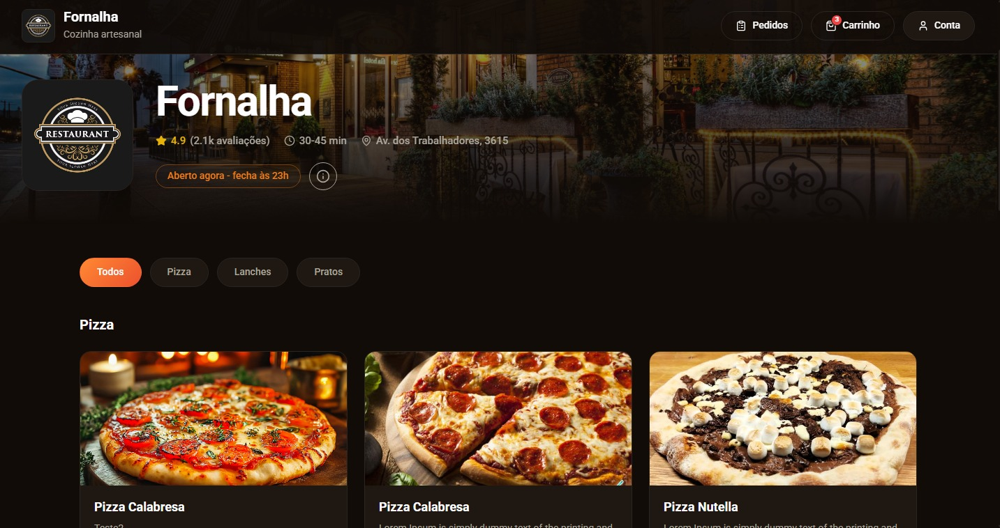
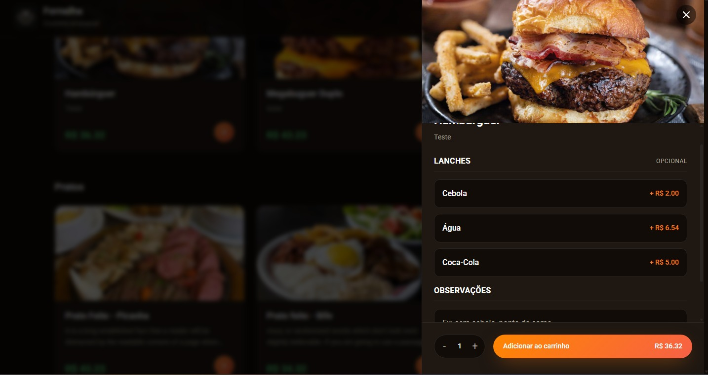
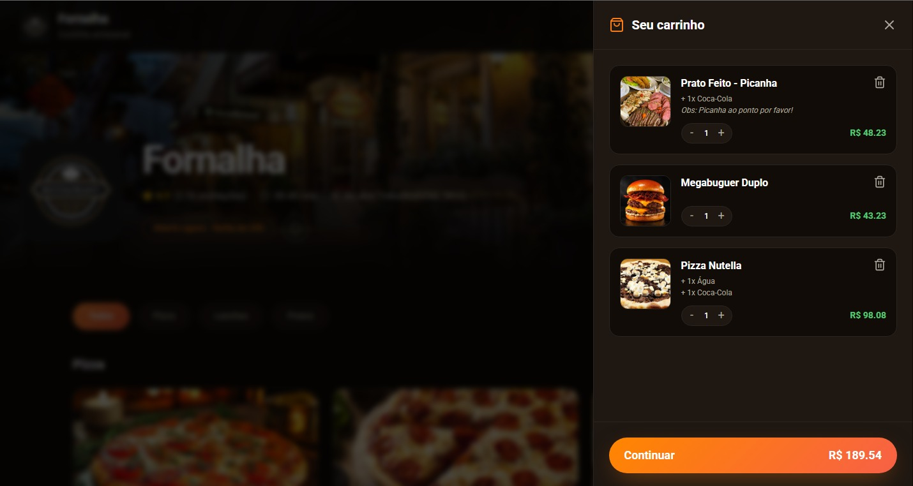
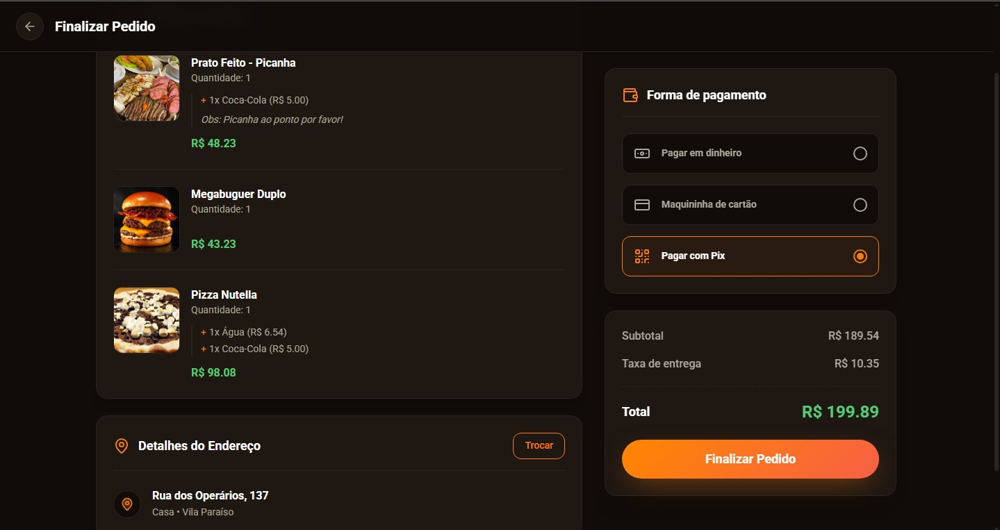
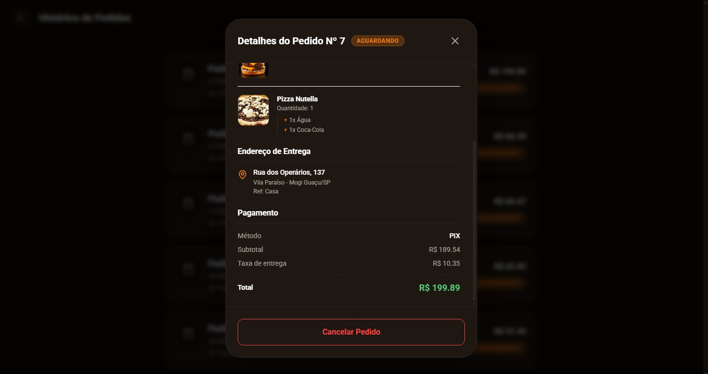
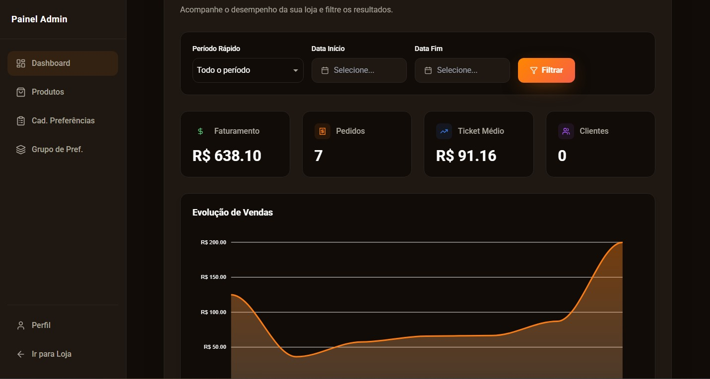
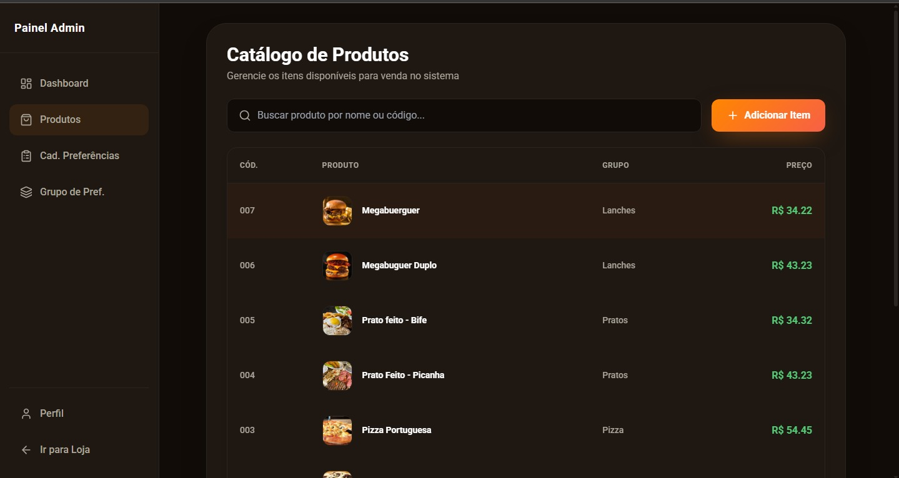
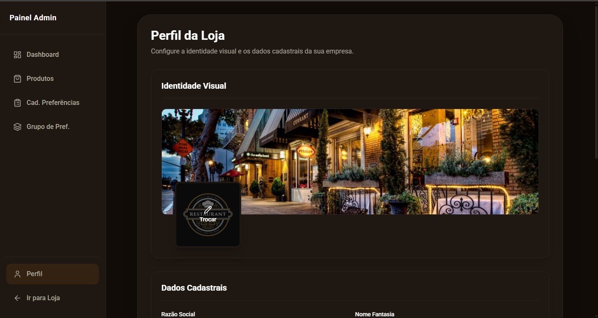

# Delivery Platform Project

O projeto é uma plataforma de delivery completa, dividida entre uma interface de cliente intuitiva e um painel administrativo. Desenvolvida para treinar e eu aprender melhor as tecnologias do angular juntamente com nestjs foco em performance, código limpo e padrões de projeto profissionais, separando responsabilidades através de uma arquitetura modular.

<br>
    
<br>

## 🖥️ Visão Geral do Frontend (Angular)

A interface da aplicação foi construída com **Angular** usando a abordagem de Standalone Components e **Tailwind CSS**, focando em uma experiência de usuário boa. A aplicação é dividida entre a área do consumidor (vitrine, carrinho, checkout, pedidos) e a área administrativa (dashboard, gestão de produtos, preferências da loja).

### Padrões e Arquitetura Frontend:
* **Facade Pattern:** Utilizado (ex: `checkout.facade.ts`) para abstrair a complexidade de múltiplos serviços e gerenciamento de estado, fornecendo uma API simples para os componentes.
* **Guards & Segurança:** Proteção de rotas utilizando Angular Guards para garantindo que apenas usuários com as permissões corretas acessem painéis específicos.
* **HTTP Interceptors:** Implementação de interceptor para injeção automática de tokens JWT em requisições seguras e tratamento global de erros de autenticação.
* **Design Responsivo:** Layout 100% adaptável construído com **Tailwind CSS**.
* **Gestão de Estado e Reatividade:** Uso do **RxJS** para comunicação assíncrona, tratamento de streams de dados do carrinho e atualizações de UI em tempo real sem recarregar a página.

### Galeria de Telas
<table>
  <tr>
    <td width="50%">
      <h3 align="center">Página Inicial</h3>
      <div align="center">
        
      </div>
    </td>
    <td width="50%">
      <h3 align="center">Detalhes do Produto</h3>
      <div align="center">
        
      </div>
    </td>
  </tr>
  <tr>
    <td width="50%">
      <h3 align="center">Carrinho de Compras</h3>
      <div align="center">
        
      </div>
    </td>
    <td width="50%">
      <h3 align="center">Checkout e Pagamento</h3>
      <div align="center">
        
      </div>
    </td>
  </tr>
  <tr>
    <td width="50%">
      <h3 align="center">Histórico de Pedidos</h3>
      <div align="center">
        
      </div>
    </td>
    <td width="50%">
      <h3 align="center">Dashboard Administrativo</h3>
      <div align="center">
        
      </div>
    </td>
  </tr>
  <tr>
    <td width="50%">
      <h3 align="center">Gestão de Produtos (Admin)</h3>
      <div align="center">
        
      </div>
    </td>
    <td width="50%">
      <h3 align="center">Perfil da Loja (Admin)</h3>
      <div align="center">
        
      </div>
    </td>
  </tr>
</table>

## ⚙️ Arquitetura Técnica do Backend (NestJS)

O backend do projeto foi projetado com **NestJS**, seguindo uma arquitetura fortemente tipada, e Domain-Driven Design. 

### 1. Arquitetura Modular e Híbrida
* **Módulos Independentes:** O código é dividido em domínios de negócio claros, facilitando a manutenção e a escalabilidade.
* **REST & GraphQL:** A aplicação utiliza uma abordagem inteligente provendo APIs RESTful tradicionais via *Controllers* para integrações padrão e uploads e  com *Resolvers* GraphQL para algumas consultas.

### 2. Persistência de Dados e ORM (Prisma)
* Modelagem de banco de dados relacional gerenciada pelo **Prisma ORM**.
* Migrations estruturadas, garantindo versionamento seguro do esquema do banco de dados e integridade referencial entre Pedidos, Usuários e Produtos.

### 3. Redis (Docker)
Para garantir respostas em milissegundos e aliviar a carga no banco de dados principal, eu uso cache em memória:
* **Redis via Docker:** Um container isolado rodando o Redis é responsável por gerenciar sessões, cache de catálogos de produtos e dados temporários do carrinho, garantindo alta disponibilidade e velocidade.

### 4. Segurança e Autenticação
* Autenticação baseada em **JWT (JSON Web Tokens)**.
* Uso de Guards no backend para bloquear o acesso a rotas privadas.
* Upload de arquivos seguro e gerenciado nativamente através do interceptor e integração com **Multer**.
* Para futuro pretendo deixa ainda mais robusto e tratar ainda mais detalhes de segurança.

---

## 🛠️ Tecnologias Utilizadas

### Frontend
* **Angular:** Framework principal.
* **TypeScript:** Tipagem estática.
* **Tailwind CSS:** Estilização utilitária e responsividade.
* **RxJS:** Programação reativa.

### Backend
* **NestJS:** Framework Node.js progressivo.
* **Prisma ORM:** Mapeamento objeto-relacional de última geração.
* **GraphQL & Apollo:** Para queries otimizadas.
* **Multer:** Processamento de uploads de imagens.

### Infraestrutura & Dados
* **Redis:** Cache de alta performance.
* **Docker:** Orquestração do ambiente do Redis.
* **Banco de Dados Relacional (MySQL):** (Gerenciado via Prisma).

---

## 🚀 Como Executar o Projeto

### Pré-requisitos
* Node.js instalado (v18+)
* Docker instalado (para rodar o Redis)
* Banco de dados relacional (MySQL) em execução

### Passo a Passo

1.  **Clone o repositório:**
    ```bash
    git clone [https://github.com/eduardofranco572/Delivery]
    ```

2.  **Suba o Redis utilizando Docker:**
    ```bash
    docker run --name redis-delivery -p 6379:6379 -d redis
    ```

3.  **Configuração do Backend:**
    ```bash
    cd backend-nestjs
    npm install
    ```
    * Duplique o arquivo `.env.example` para `.env` e configure sua `DATABASE_URL` (Prisma) e a URL do Redis.
    * Rode as migrations do banco de dados:
        ```bash
        npx prisma migrate dev
        ```
    * Inicie o servidor backend:
        ```bash
        npm run start:dev
        ```

4.  **Configuração do Frontend:**
    em um novo terminal rode:
    ```bash
    cd frontend-delivery
    npm install
    ```
    * Inicie a aplicação Angular:
        ```bash
         ng serve
        ```

Acesse a interface da aplicação em: `http://localhost:4200` e a API em `http://localhost:3000`.

---

<br>
<br>

<div align="center" style="display: inline-block">
  <br>
  <p>Tecnologias utilizadas na aplicação</p>

  
  
  
  
  
  
  
  

</div>
<br>

# Desenvolvedor:
- Eduardo Franco Seco (Full-Stack) <br>
  [](https://github.com/eduardofranco572)
  [](https://www.linkedin.com/in/eduardo-franco572/)
